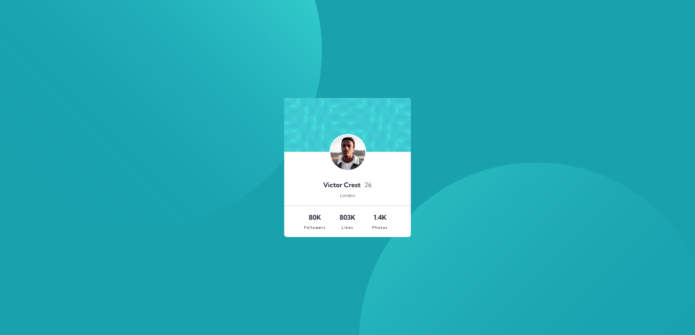

# Frontend Mentor - Profile card component solution

This is a solution to the [Profile card component challenge on Frontend Mentor](https://www.frontendmentor.io/challenges/profile-card-component-cfArpWshJ).

## Table of contents

- [Overview](#overview)
  - [The challenge](#the-challenge)
  - [Screenshot](#screenshot)
- [My process](#my-process)
  - [Built with](#built-with)
  - [What I learned](#what-i-learned)
- [Author](#author)
- [Acknowledgments](#acknowledgments)

## Overview

### The challenge

- Build out the project to the designs provided.

### Screenshot

## My process

### Built with

- HTML5
- CSS custom properties
- Flexbox
- CSS Grid

### What I learned

With this challenge I could put in practice elements that I studying right now such as: CSS flexbox, CSS grid, positions (relative, fixed and absolute) and how to use a container properly.

### Continued development

My objetive is continue doing more challenges like this one to improve the areas i mentioned before, for in the next days I start to implement JS.

## Author

- Twitter - [@JooTercio](https://twitter.com/JooTercio)

## Acknowledgments

One month ago, if you asked me If I could creat a simple project like this one, I probaly gonna aswer you DONT, but with the courses I doing in DEVQUEST and ORIGAMID, I felling really happy with this whole process and motivated to build new Front End projects.
